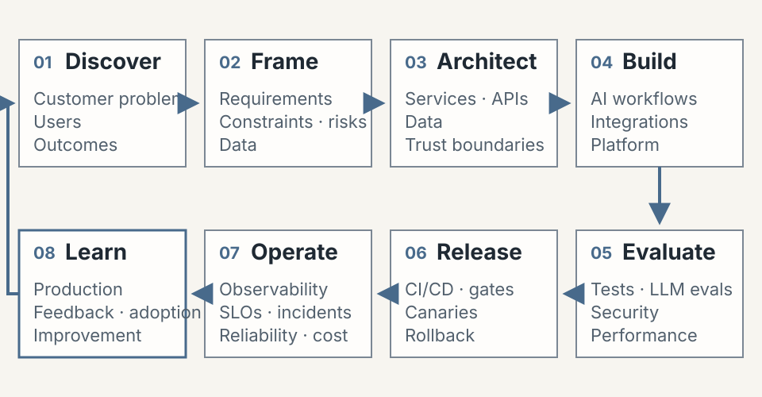

# Rohit Agrawal

Principal-level engineer with **14+ years** across customer delivery,
distributed systems, cloud platforms, automation, CI/CD, observability, and
production reliability.

> **Career direction:** Moving into **Forward-Deployed AI**, **AI Platform
> Engineering**, and **LLMOps / AI Reliability**.

I am applying that foundation through independent systems in grounded RAG,
citations and refusal controls, multi-model and agentic workflows, LLM
evaluation, provider readiness and fallback behaviour, security, cost controls,
observability, and release governance.

**Former Oracle Principal Member of Technical Staff** · **led and mentored 11+
engineers** · **Bengaluru, India**

[LinkedIn](https://www.linkedin.com/in/rohitagrawal14) ·
[Email](mailto:rohit.ra.agrawal@gmail.com) ·
[Selected systems ↓](#selected-independent-ai-systems)

## Engineering lifecycle

*Applying principal-level delivery, platform, and reliability engineering to
trustworthy AI systems.*

<picture>
  <source
    media="(max-width: 600px) and (prefers-color-scheme: dark)"
    srcset="assets/engineering-lifecycle-mobile-dark.svg">
  <source
    media="(max-width: 600px)"
    srcset="assets/engineering-lifecycle-mobile-light.svg">
  <source
    media="(prefers-color-scheme: dark)"
    srcset="assets/engineering-lifecycle-dark.svg">
  
</picture>

*This lifecycle is an operating model, not a claim that every independent
project is deployed, adopted, or operating in production.*

## The direction I am building toward

I am moving into Forward-Deployed AI, AI Platform Engineering, and LLMOps / AI
Reliability by extending an established foundation in customer delivery,
distributed systems and data platforms, release governance, and production
reliability. The systems below are independent portfolio work—not
employer systems. My direct AI evidence is strongest in LLM applications,
evaluation, and reliability. Classical end-to-end MLOps remains an active
capability-building area, not a claim of deep current expertise or complete
lifecycle ownership.

## Selected independent AI systems

### 01 / CiteVyn

**Answers a practical question:** Can I trust this AI-generated answer—and can I
trace every claim to an authoritative source?

**What it delivers:** Citation-grounded answers, strict refusal, and versioned
retrieval with evaluation-gated index promotion.

`Grounded RAG` · `Citations` · `Strict refusal` · `Versioned retrieval` ·
`Evaluation gates`

**State:** Public, production-oriented application architecture with a
repository-reported demo; current provider health, active index, users, and
adoption are not claimed.

[Repository](https://github.com/imrohitagrawal/citevyn) ·
[Architecture and trade-offs](https://github.com/imrohitagrawal/citevyn/blob/3d28fc8bf7a9de1903881ea7211ecb79a6f79eb5/docs/ARCHITECTURE.md)

### 02 / Quorum-AI

**Answers a practical question:** How can I compare several models while
controlling cost, provenance, disagreement, and degraded execution?

**What it delivers:** Parallel analysis, critique, and structured synthesis with
pre-run cost approval and explicit provider or simulation disclosure.

`Multi-model orchestration` · `Critique and synthesis` · `Cost gates` ·
`Provider provenance` · `Degraded modes`

**State:** Public portfolio application; live execution is
configuration-dependent, and runs may disclose failed slots, fallbacks, or
whole-run simulation. Four live providers and adoption are not claimed.

[Repository](https://github.com/imrohitagrawal/quorum-ai) ·
[Architecture](https://github.com/imrohitagrawal/quorum-ai/blob/303228262d7697793a268550a3b287d27f1a1584/docs/20-architecture.md)

### 03 / SaafSaans

**Answers a practical question:** What does current air quality mean for my
plans—and when might conditions improve?

**What it delivers:** Persona-scoped general guidance with citations, feed
provenance, and labelled live-data, deterministic, or sample modes.

`Grounded guidance` · `Citations` · `Feed provenance` · `Labelled fallbacks` ·
`Injection guard`

**State:** Public, non-medical guidance; risk scoring is heuristic, not
clinically validated; feeds may fall back; CPCB pollutant coverage is
incomplete; and WAQI non-commercial-use and redistribution restrictions apply.

[Repository](https://github.com/imrohitagrawal/saaf-saans) ·
[Decision record](https://github.com/imrohitagrawal/saaf-saans/blob/3bac09012cc1a5e36d24505e54d6155ff0664aa3/docs/CASE-STUDY.md)

### 04 / NarraTwin AI

**Answers a practical question:** How can project knowledge become an
audience-specific walkthrough without inventing unsupported claims?

**What it delivers:** Grounded scripts with citations, unsupported-claim
evaluation, consent checks, and release gates before synthetic-media generation.

`Grounded scripts` · `Citations` · `Claim evaluation` · `Consent` ·
`Release governance`

**State:** Local/mock Phase 1 under explicit No-Go: local-only and
single-process, with optional file-backed restart recovery—not multi-worker or
production durability. No hosted deployment, provider-backed generation, real
video release, or public distribution is established.

[Repository](https://github.com/imrohitagrawal/narratwin-ai) ·
[Release readiness](https://github.com/imrohitagrawal/narratwin-ai/blob/454025c403334933306142f65bc3e25541eeb23e/docs/RELEASE_READINESS_REVIEW.md)

## Established engineering foundation

From April 2019 to April 2026, I was an Oracle **Principal Member of Technical
Staff**. Across employer-backed work, my foundation spans customer delivery and
UAT; distributed systems, analytics, data platforms, and microservices; OCI
cloud delivery—my strongest professional cloud; CI/CD, release governance, and
automation architecture; and telemetry, canaries, dashboards, alarms, runtime
validation, and production reliability.

Selected professional outcomes, separate from my independent AI portfolio:

- MTTD reduced approximately 35% through telemetry and dashboards.
- Targeted release workflows reduced cycle time approximately 25%.

## Engineering principles

> Engineer for trust before deployment. Validate reliability continuously in
> production. Shift-left by default. Shift-right by design.

I make evaluation, observability, explicit degraded modes, security, and release
gates part of system design.

## Contact

I am open to conversations about Forward-Deployed AI, AI platform engineering,
and LLMOps / AI reliability.
Based in Bengaluru, India; **open to relocation globally**.

[LinkedIn](https://www.linkedin.com/in/rohitagrawal14) ·
[Email](mailto:rohit.ra.agrawal@gmail.com)
