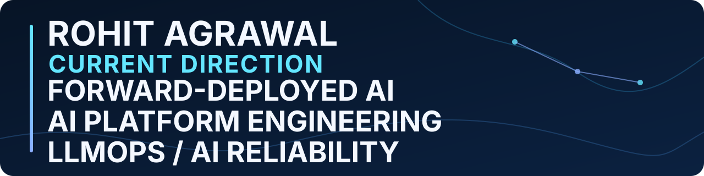

# Rohit Agrawal

I am a principal-level engineer extending **14+ years** of customer delivery,
distributed systems, cloud delivery, release governance, and production
reliability into trustworthy AI systems.

**CURRENT DIRECTION — Forward-Deployed AI · AI Platform Engineering · LLMOps /
AI Reliability**

**Bengaluru, Karnataka, India** ·
[LinkedIn](https://www.linkedin.com/in/rohitagrawal14) ·
[Email](mailto:rohit.ra.agrawal@gmail.com)

**Employer-backed foundation:** Former Oracle `Principal Member of Technical
Staff`; customer delivery and UAT, data platforms and microservices, OCI cloud
delivery, CI/CD, observability, and production support.

**Independent portfolio:** Grounded AI applications, evaluation and reliability
mechanisms, explicit degraded modes, cost and security controls, and governed
release boundaries. These are independent projects, not employer systems.

## Selected independent AI systems

### [CiteVyn](https://github.com/imrohitagrawal/citevyn)

**Problem and system.** RAG answers need traceable evidence and the discipline to
refuse unsupported questions. CiteVyn implements citation-grounded answers,
strict refusal envelopes, hybrid retrieval, versioned ingestion and index
promotion, evaluation gates, Redis-backed rate limiting, and structured health
and observability.

**Maturity boundary.** A public, production-oriented application architecture
with a repository-reported demo. No current provider health, active index state,
users, or adoption claim is made. [Repository](https://github.com/imrohitagrawal/citevyn)
· [Architecture and trade-offs](https://github.com/imrohitagrawal/citevyn/blob/3d28fc8bf7a9de1903881ea7211ecb79a6f79eb5/docs/ARCHITECTURE.md)

### [Quorum-AI](https://github.com/imrohitagrawal/quorum-ai)

**Problem and system.** Multi-model analysis needs controlled parallelism,
critique, synthesis, spend, provenance, and degraded modes. Quorum-AI uses four
model slots, parallel initial analysis, critique rounds, structured synthesis,
pre-run cost approval, readiness state, redaction, request IDs, metrics, and
provider provenance.

**Maturity boundary.** A public portfolio application. Live-provider execution
is configuration-dependent; runs can disclose failed slots, fallback paths, or
whole-run simulation, so no claim is made that every run uses four live
providers. [Repository](https://github.com/imrohitagrawal/quorum-ai) ·
[Architecture](https://github.com/imrohitagrawal/quorum-ai/blob/303228262d7697793a268550a3b287d27f1a1584/docs/20-architecture.md)

### [SaafSaans](https://github.com/imrohitagrawal/saaf-saans)

**Problem and system.** Air-quality guidance must expose its sources, data mode,
uncertainty, and health boundary. SaafSaans combines persona-scoped grounded
guidance, citations, live-data adapters with labelled deterministic or sample
fallbacks, feed provenance, a prompt-injection guard, telemetry, and security
views.

**Maturity boundary.** A public portfolio application providing general
guidance, not medical advice. Its risk score is heuristic and not clinically
validated;
feeds can degrade to labelled fallback data; CPCB recomputation uses incomplete
pollutant coverage; and WAQI data has non-commercial and redistribution
restrictions. [Repository](https://github.com/imrohitagrawal/saaf-saans) ·
[Decision record](https://github.com/imrohitagrawal/saaf-saans/blob/3bac09012cc1a5e36d24505e54d6155ff0664aa3/docs/CASE-STUDY.md)

### [NarraTwin AI](https://github.com/imrohitagrawal/narratwin-ai)

**Problem and system.** Synthetic-media workflows need grounded scripts, claim
evaluation, consent, provenance, and release control before media generation.
NarraTwin AI implements project and knowledge ingestion, retrieval, cited
scripts, unsupported-claim evaluation, UI output, consent, and governance gates.

**Maturity boundary.** Local/mock Phase 1 with an explicit No-Go posture:
local-only and single-process, with optional file-backed local restart recovery;
this is not multi-worker or production durability. It does not establish a
public hosted deployment, external provider-backed generation, real video
release, or public synthetic-media distribution.
[Repository](https://github.com/imrohitagrawal/narratwin-ai) ·
[Release-readiness evidence](https://github.com/imrohitagrawal/narratwin-ai/blob/454025c403334933306142f65bc3e25541eeb23e/docs/RELEASE_READINESS_REVIEW.md)

## Established engineering foundation

I was an Oracle **Principal Member of Technical Staff** from April 2019 to April
2026. Across employer-backed work, my engineering foundation spans customer
delivery and UAT;
distributed systems, analytics, data platforms, and microservices; cloud
delivery, with OCI as my strongest professional cloud; CI/CD, release governance,
and engineering productivity; automation architecture; telemetry, canaries,
dashboards, alarms, and runtime validation; and production troubleshooting,
runbooks, reliability, and incident detection.

My technical leadership includes having **led and mentored 11+ engineers**.

Selected professional outcomes, kept separate from the independent AI projects:

- MTTD reduced approximately 35% through telemetry and dashboards.
- Targeted release workflows reduced cycle time approximately 25%.

## How I engineer for trust

> Engineer for trust before deployment. Validate reliability continuously in
> production.
>
> Shift-left by default. Shift-right by design.

I make evidence boundaries, failure modes, degraded-mode disclosure,
observability, evaluation, and release gates part of system design. This is a
method for systems that may be deployed, not a claim that every portfolio
project is deployed or operating in production.

## Current capability building

My direct AI evidence is strongest in LLM applications, evaluation, and
reliability systems. Forward-deployed readiness builds on established customer
delivery, UAT, integration, and production-support experience. I am deliberately
building classical end-to-end MLOps capability; I do not claim deep current
lifecycle ownership.

## Connect

I am open to conversations about Forward-Deployed AI, AI platform engineering,
LLMOps / AI reliability, and principal-level systems and reliability work.

[LinkedIn](https://www.linkedin.com/in/rohitagrawal14) ·
[Email](mailto:rohit.ra.agrawal@gmail.com)
